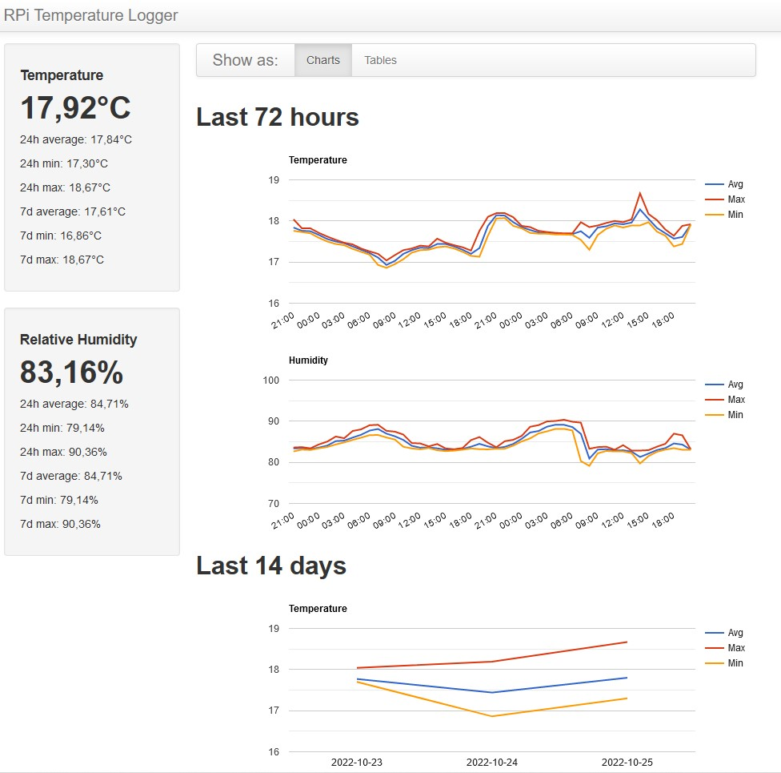

# PiKrellCam Motion Detection with Sensor Data Logger

This fork introduces an additional web-dashboard driven by a *sqlite* database to keep track of temperature and humidity readings coming from a HDC1080 sensor. This dashboard is accessible by the main page of the camera preview bringing in some statistics of the collected data.

It is aimed at:

- tracking sensor data;
- keeping the original motion detection component alive and updated;
- improve its original web interface with modern components;
- building a nice dashboard for one or more sensors (via I2C interface);

## Current state (work in progress)

October 2022
- Changed most (if not all) of the original source code indentation style ;)
- Updated web components with recent versions (jquery, jqueryui)
- Introducing bootstrap for the logger dashboard
- Added working support to the HDC1080 temperature and humidity sensor via Python and I2C interface

## Legacy Version

PiKrellCam is an audio/video recording motion detect program with an OSD web
interface that detects motion using the Raspberry Pi camera MMAL motion vectors.

Read about it and install instructions at:
[PiKrellCam webpage](http://billw2.github.io/pikrellcam/pikrellcam.html)

Original repository:
    $ git clone https://github.com/billw2/pikrellcam

